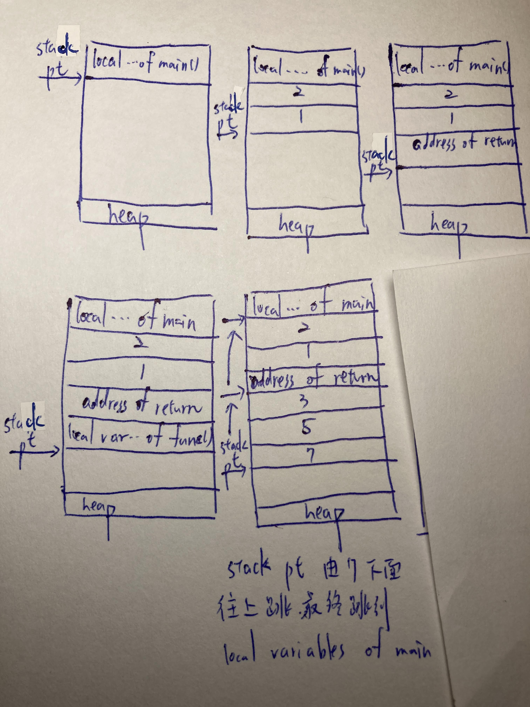

# 手寫作業week7 戴偉璿

## 第一題

$\text{(B)(C)}$

## 第二題

$\text{a}.$
---
他直接將函式內定義的代碼插入函式中。這樣一來就不用每次都呼叫，自然能結省時間。

$\text{b}.$
---
每一次遞迴都會傳導引數並且除存地址，多做了許多事情，（比如呼叫$n$此就要花$n$次分配$n\times$區域性變數，$n\times$呼叫函式地址、$n\times$返回值）

$\text{c}.$
---

|local variables of main()|
|-|
|4|
|return address |
|old frame pointer|
|local variables of fib(4)|
|return address |
|old frame pointer|
|local variables of fib(3)|
|return address |
|old frame pointer|
|local variables of fib(2)|
|return address|
|old frame pointer|
|local variables of fib(1)|
|return address |
|old frame pointer|
|heap|

 |local variables of main()|
|-|
|4|
|return address |
|old frame pointer|
|local variables of fib(4)|
|return address |
|old frame pointer|
|local variables of fib(3)|
|return address |
|old frame pointer|
|local variables of fib(2)|
|return address|
|old frame pointer|
|local variables of fib(0)|
|return address |
|old frame pointer|
|heap|

 |local variables of main()|
|-|
|4|
|return address |
|old frame pointer|
|local variables of fib(4)|
|return address |
|old frame pointer|
|local variables of fib(3)|
|return address |
|old frame pointer|
|local variables of fib(1)|
|return address|
|old frame pointer|
| |
|heap|

 |local variables of main()|
|-|
|4|
|return address |
|old frame pointer|
|local variables of fib(4)|
|return address |
|old frame pointer|
|local variables of fib(2)|
|return address |
|old frame pointer|
| |
|heap|

 |local variables of main()|
|-|
|4|
|return address |
|old frame pointer|
|local variables of fib(4)|
|return address |
|old frame pointer|
|local variables of fib(2)|
|return address |
|old frame pointer|
|local variables of fib(1)|
|return address|
|old frame pointer|
| |
|heap|

 |local variables of main()|
|-|
|4|
|return address |
|old frame pointer|
|local variables of fib(4)|
|return address |
|old frame pointer|
|local variables of fib(2)|
|return address |
|old frame pointer|
|local variables of fib(0)|
|return address|
|old frame pointer|
| |
|heap|

 |local variables of main()|
|-|
||
|heap|

$\text{d}.$
---
